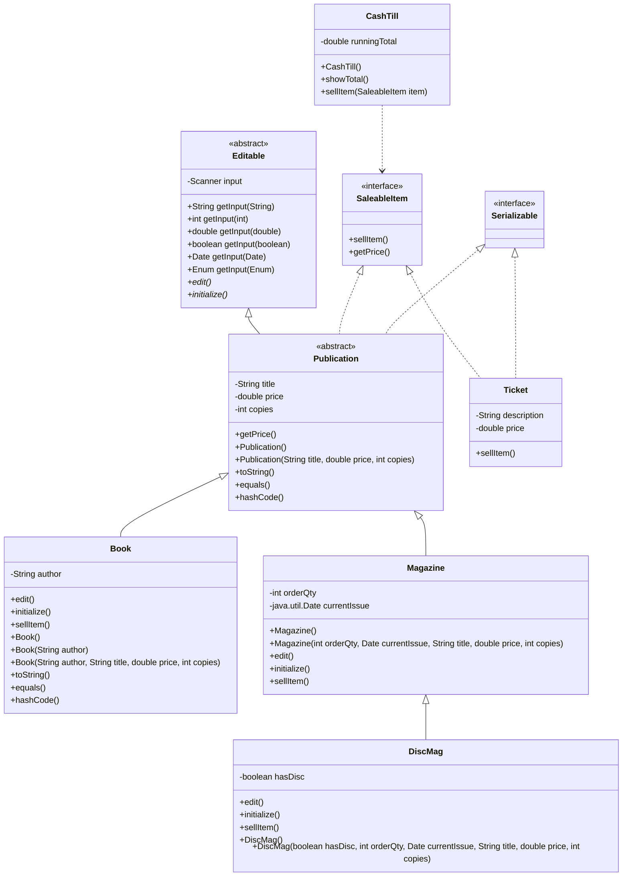

```mermaid

classDiagram

class Editable {
<<abstract>>
-Scanner input
+String getInput(String)
+int getInput(int)
+double getInput(double)
+boolean getInput(boolean)
+Date getInput(Date)
+Enum getInput(Enum)
+edit()*
+initialize()*
}

class SaleableItem {
<<interface>>
+sellItem()
+getPrice()
}

class Serializable {
<<interface>>
}

class Publication {
<<abstract>>
-String title
-double price
-int copies
+getPrice()
+Publication()
+Publication(String title, double price, int copies)
+toString()
+equals()
+hashCode()
}

class Book {
-String author
+edit()
+initialize()
+sellItem()
+Book()
+Book(String author)
+Book(String author, String title, double price, int copies)
+toString()
+equals()
+hashCode()
}

class Magazine {
-int orderQty
-java.util.Date currentIssue
+Magazine()
+Magazine(int orderQty, Date currentIssue, String title, double price, int copies)
+edit()
+initialize()
+sellItem()
}

class DiscMag {
-boolean hasDisc
+edit()
+initialize()
+sellItem()
+DiscMag()
+DiscMag(boolean hasDisc, int orderQty, Date currentIssue, String title, double price, int copies)
}

class Ticket {
-String description
-double price
+sellItem()
}

class CashTill {
-double runningTotal
+CashTill()
+showTotal()
+sellItem(SaleableItem item)
}

Editable <|-- Publication
Publication <|-- Book
Publication <|-- Magazine
Magazine <|-- DiscMag
SaleableItem <|.. Publication
SaleableItem <|.. Ticket
Serializable <|.. Publication
Serializable <|.. Ticket
CashTill ..> SaleableItem

```
